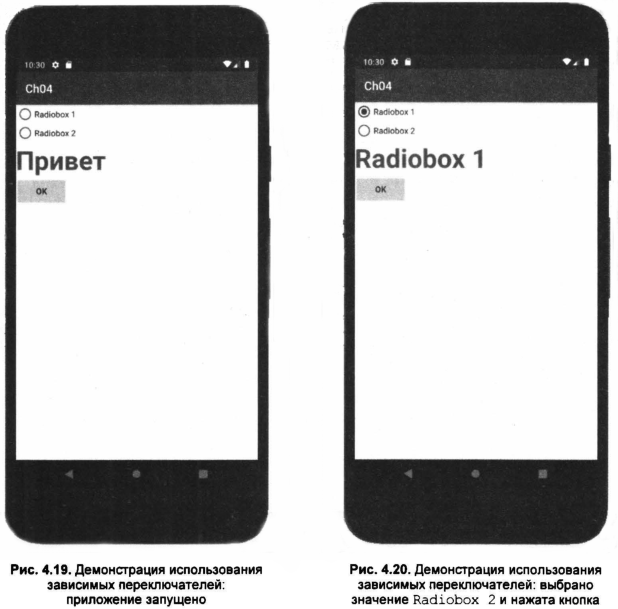

# RadioButton - зависимые переключатели
Зависимые переключатели (виджеты класса _RadioButton_) используются внутри контейнера __RadioGroup__ — группы зависимых переключателей. Зависимый переключатель позволяет выбрать только одну из опций в одной из групп переключателей.
В одной из групп может быть активным только один переключатель.
Вы в основном будете пользоваться тремя методами:
* toggle() — инвертирует состояние зависимого переключателя;
* isChecked() — возвращает значение зависимого переключателя(__true__ — активен);
* setChecked() — изменяет значение переключателя в зависимости от переданного параметра.

Для демонстрации работы с зависимыми переключателями добавьте в наш проект с кнопкой и текстовым полем два зависимых переключателя с именами r1 и r2. По нажатию на кнопку значение текстового поля будет изменено в зависимости от выбранного переключателя. Если ни один из переключателей не выбран, тогда значение *TextView* изменено не будет. Разметка проекта приведена в листинге 4.12.

  <p align="center">Листинг 4.12. Файл разметки проекта(зависимые переключатели) </p>

  ```xml
<?xml version="1.0" encoding="utf-8"?>
<RadioGroup xmlns:android="http://schemas.android.com/apk/res/android"
    android:orientation="vertical"
    android:layout_width="fill_parent"
    android:layout_height="fill_parent">
<RadioButton
    android:text="Radiobox 1"
    android:id="@+id/r1"
    android:layout_width="wrap_content"
    android:layout_height="wrap_content">
</RadioButton>
<RadioButton android:text="Radiobox 2"
    android:id="@+id/r2"
    android:layout_width="wrap_content"
    android:layout_height="wrap_content">
</RadioButton>
<TextView
    android:id="@+id/txt1"
    android:layout_width="fill_parent"
    android:layout_height="wrap_content"
    android:textSize="20pt"
    android:textStyle="bold"
    android:text="Пpивeт"
/> 
<Button
    android:text="OK"
    android:id="@+id/button1"
    android:layout_width="wrap_content"
    android:layout_height="wrap_content">
</Button>
</RadioGroup>
```

Как видите, все достаточно просто. Готовое приложение показано на рис. 4.19
(приложение запущено) и 4.20 (выбрано значение *Radiobox 2* и нажата кнопка).


<p align="center">Рис 4.19. Демонстрация использования зависимых переключателей: приложение запущено </p>



# CheckBox — независимые переключатели

Переключатели __CheckBox__ не привязываются к какому-либо контейнеру (вроде *RadioGroup*), их значение не зависит от состояния других переключателей, поэтому они и называются независимыми.

Для работы с __CheckBox__ вы можете использовать те же методы (*isChecked()*, *toggle ()*, *setChecked ()* ), что и в случае с __RadioButton__. В файле разметки независимые переключатели определяются так:

```Xml
<CheckBox
    android:id="@+id/checkbox"
    android:layout_width="wrap_content"
    android:layout_height="wrap_content"
    android:text="Yes"/>
```
Найти __CheckBox__  в Java—коде можно так:
```Java
final CheckBox check = (CheckBox)findViewByid(R.id.checkbox);
```
Далее можно проверить, включен ли переключатель:
```Java
if (check.isChecked()) txt1.setText("OK");
```

# ToggleButton - кнопка включено/выключено
Кнопка *ToggleButton* может находиться в одном из двух положений: включено или выключено. Когда кнопка нажата, горит зеленый индикатор, как бы встроенный в кнопку, также видно, что кнопка немного вдавлена.

По большому счету от *ToggleButton* можно было отказаться и использовать обычный виджет __CheckВox__, однако кнопка *ToggleButton* выглядит более привлекательно и больше подходит для включения/выключения режимов программы, чем переключатель __CheckBox__.

У кнопки есть два основных свойства: *android: textOff* и *android: textOn*. Первое устанавливает текст кнопки, когда она выключена, а второе —
когда включена. В программном коде этим свойствам соответствуют методы *setTextOff ()* и *setTextOn ()*.

С помощью метода *setChecked(boolean checked)* вы можете программно изменить состояние кнопки. При изменении состояния генерируется
событие *onCheckedChanged()*.

Добавьте в наш проект кнопку *ToggleButton* и удалите все, что нам не нужно. Пусть в проекте останутся только текстовое поле *TextView*, кнопка *Button* (она нам еще пригодится) и новая кнопка *ToggleButton*. Разметка проекта представлена в листинге 4.13.

<p align="center">Листинг 4.13. Использование кнопки ToggleButton(файл разметки)</p>

```Xml
<?xml version="1.0" encoding="utf-8"?>
<LinearLayout xmlns:android="http://schemas.android.com/apk/res/android"
    android:orientation="vertical"
    android:layout_width="fill_parent"
    android:layout_height="fill_parent"
>
<TextView
    android:id="@+id/txt1"
    android:layout_width="fill_parent"
    android:layout_height="wrap_content"
    android:textSize="20pt"
    android:textStyle="bold"
    android:text="Выкл"
/>
<ToggleButton
    android:textOff="Off"
    android:textOn="Bкл"
    android:id="@+id/tb1"
    android:layout_width="wrap_content"
    android:layout_height="wrap_content">
</ToggleButton>
</LinearLayout>
```
При нажатии на кнопку *ToggleButton* в зависимости от состояния кнопки будет изменяться значение текстового поля. Этот эффект достигается благодаря обработчику события *onCheckedChange*. Код Java представлен в листинге 4.14.

<p align="center">Листинг 4.14. Пример использования кнопки ToggleButton </p>

```Java
package com.example.ch04;
import android.support.v7.app.AppCompatActivity;
import android.os.Bundle;
import android.view.View;
import android.widget.TextView;
import android.widget.CompoundButton;
import android.widget.CompoundButton.OnCheckedChangeListener;
import android.widget.ToggleButton;

  public class MainActivity extends AppCompatActivity {
        @Override
        protected void onCreate(Bundle savedinstanceState) {
            super.onCreate(savedInstanceState);
            setContentView(R.layout.activity_main);
            
            final TextView txt1 = (TextView)findViewById(R.id.txt1);
            final ToggleButton toggle = (ToggleButton)findViewById(R.id.tb1);
            
            toggle.setOnCheckedChangeListener(new OnCheckedChangeListener() {
                 public void onCheckedChanged(
                    CompoundButton buttonView, boolean isChecked) {
                      if (isChecked)
                        txt1.setText("Вкл");
                      else
                        txt1.setText("Выкл");
                     }
                 });
             }
}
```
Результат внесенных в код изменений показан на рис. 4.21.
 

# ImageButton — кнопка с изображением

Виджет __ImageButton__ — что-то среднее между изображением и кнопкой. Вместо текста у этой кнопки будет изображение, что позволяет создавать более привлекательные кнопки.
Установить изображение кнопки можно или атрибутом *android:src* элемента ```<ImageButton>``` или методом *setImageResource (int)*.

В файле разметки элемент ```<Imageвutton>``` описывается так:

```Xml
<ImageButton
    android:id="@+id/button"
    android:layout_width="wrap_content"
    android:layout_height="wrap_content"
    android:src="@drawable/icon"
/>
```
Работа с такой кнопкой осуществляется так же, как и с обычной кнопкой. Первым делом нужно подключить необходимый пакет, объявить переменную и найти сам элемент в файле разметки:
```Java
import android.widget.ImageButton;
...
ImageButton button;
...
button = (ImageButton)findViewById(R.id.button);
button.setImageResource(R.drawable.im);
```
Последние два оператора находят кнопку *ImageButton* и устанавливают для нее изображение с именем *play*, которое находится в папке res\drawable или res\drawble-*(имя зависит от разрешения экрана — для более новых платформ Android). Лучше всего использовать файлы в формате PNG. В нашем случае (ресурс R .drawable.im) в каталоге res\drawable должен присутствовать файл __im.png__.

Обработчик нажатия кнопки устанавливается так же, как и для обычной кнопки *Button*.

# 4.2.3 Индикатор ProgressBar
Сейчас мы рассмотрим весьма интересный виджет — __ProgressBar__, представляющий собой индикатор (шкалу) процесса.

Начнем с разметки (листинг 4.15). Наша деятельность будет содержать два поля ввода, кнопку и, конечно же, ProgressBar. Редактор разметки для нашего приложения показан на рис. 4.22.

<p align="center">Листинг 4.15. Разметка ProgressBar </p>

```Xml
<?xml version="1.0" encoding="utf-8"?>
<LinearLayout xmlns:android = "http://schemas.android.com/apk/res/android"
    android:orientation="vertical"
    android:layout_width="fill_parent"
    android:layout_height="fill_parent"
>
<TextView android:id="@+id/TextView02"
    android:layout_width="wrap_content"
    android:layout_height="wrap_content"
    android:text="Maкcимyм">
</TextView>
<EditText android:layout_width="wrap_content"
    android:layout_height="wrap_content"
    android:text="1OO"
    android:id="@+id/maximum">
</EditText>
<TextView android:id="@+id/TextView01"
    android:layout_width="wrap_content"
    android:layout_height="wrap_content"
    android:text="Шаг">
</TextView>
<EditText android:layout_width="wrap_content"
    android:layout_height="wrap_content"
    android:text="5"
    android:id="@+id/increment">
</EditText>
<Button android:layout_width="wrap_content"
    android:layout_height="wrap_content"
    android:text="Пycк"
    android:id="@+id/startbtn">
</Button>
</LinearLayout>
```
